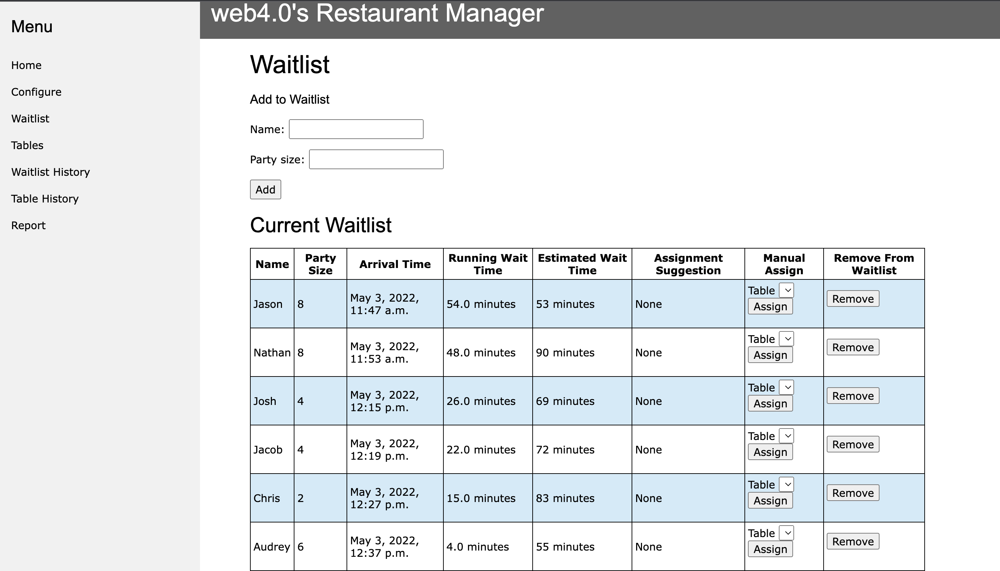
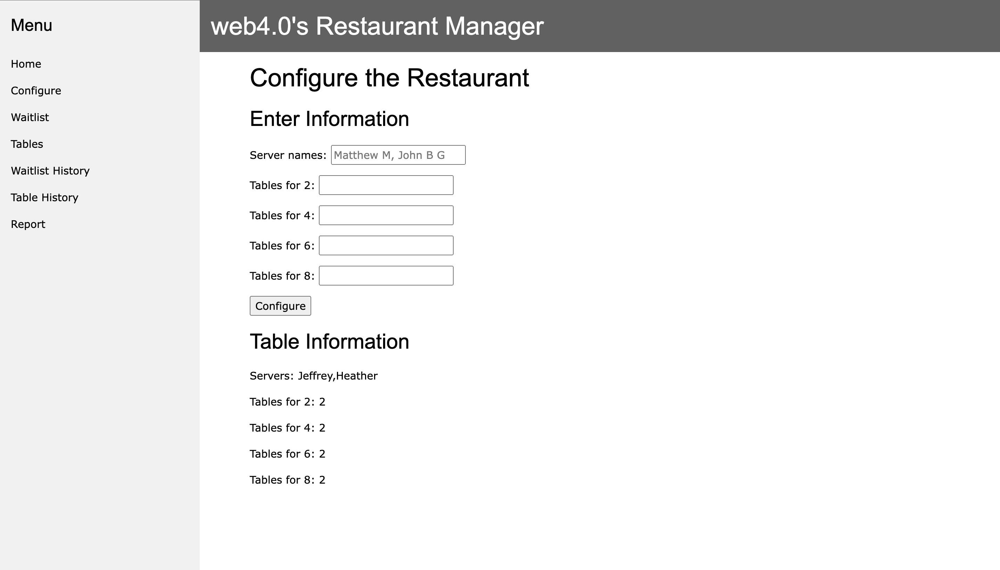
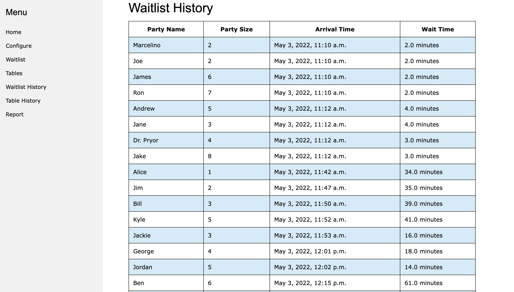
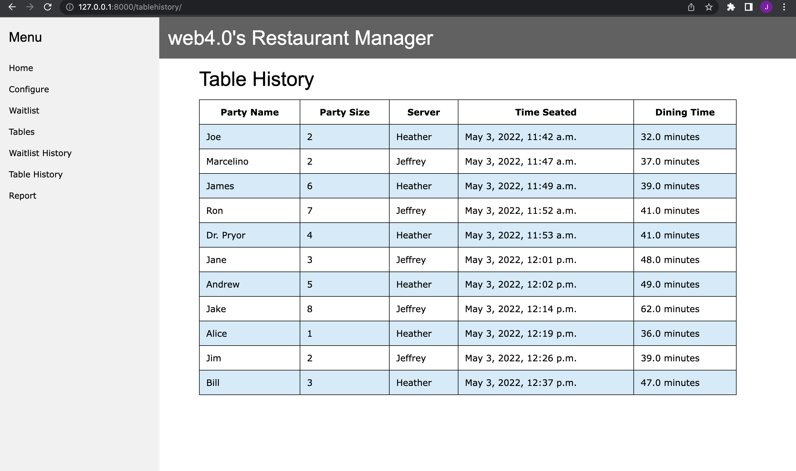
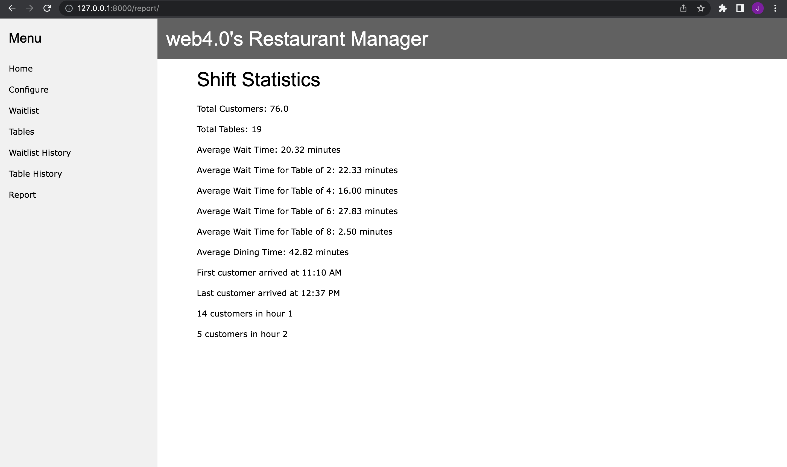

# web4.0 Restaurant Manager
Help out your host and manager, or just see what Django can do with this creative webapp.

# Key Features
* Manage your waitlist and table assignments with the click of a button
* Smart table assignment suggestions to minimize customer wait times
* Table suggestion override / manual assignment available
* Smart server assignment to balance workload on your waiters and waitresses
* Automatic estimations of wait time based on customer arrival and party size
* Change your restaurant layout at the start of every shift to accomodate your current setup
* View a report during or at the end of your shift with important statistics on your restaurant performance
    * Customer wait times, server workload, table turnover, etc.


# Setup
1. Navigate to your desired directory
2. Create and/or activate your virtual environment
    * Virtual environment help: https://docs.python.org/3/library/venv.html
3. Ensure Django is installed
    * Django installation: https://docs.djangoproject.com/en/4.0/topics/install/
4. Clone your repository

# View the Site
1. Navigate into the new_rest directory
    ```
    cd new_rest/
    ```
2. Make migrations
   ```
    python manage.py makemigrations
    ``` 
3. Migrate
    ```
    python manage.py migrate
    ```
4. Make yourself a superuser (follow prompts)
    ```
    python manage.py createsuperuser
    ```
5. Run the site
    ```
    python manage.py runserver
    ```
6. Paste the link in your browser to view
    http://127.0.0.1:8000/
 


Note: If not editing the Django code, only running the site is necessary after the initial run

# Page Breakdown
## Waitlist
View the entire waitlist and each customer's information: party name, size, arrival time, estimated wait time, and running wait time.

Add people, remove people, assign people on the waitlist to the computer's suggested table, or manually assign people to tables.


## Tables
View all the tables and their information: table number, seated party, capacity, time seated, running dine time, and server name.

Clear the table for a new customer.


## Configure
View the current restaurant configuration for the shift.

Define the server names and number of each type of table to start a new shift with your restaurant setup.


## Waitlist History
View everyone who has been on the waitlist during/after the shift.


## Table History
View information about all of the tables during/after the shift.


## Report
View statistical information on the average wait times, table turnover, server workload, and more about the shift.


# Admin page
View all of your objects in the admin page by adding the extension "admin/" to the home url.
 http://127.0.0.1:8000/admin/

Login after making yourself a superuser.
Add or delete people from the waitlist or tables.
Clear your waitlist and table history.
